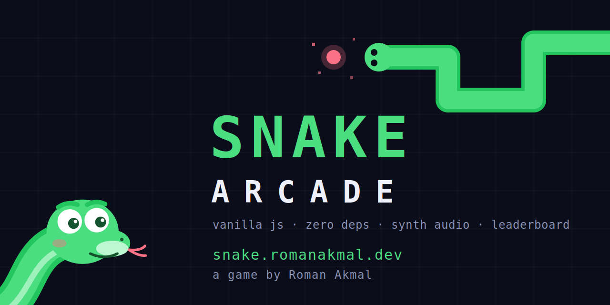
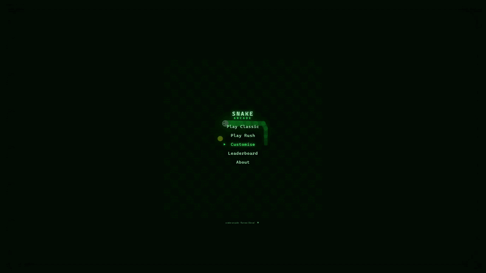
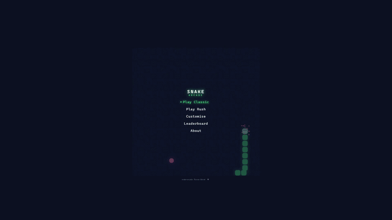
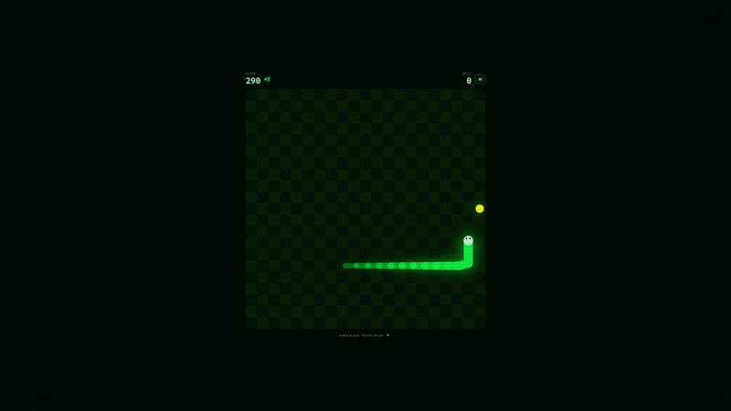

<div align="center">

# 🐍 Snake Arcade

**A full-stack browser arcade game with zero dependencies.**

Vanilla JS + Canvas + WebAudio on the front, Vercel serverless + Redis on the back.
No frameworks. No build tools. No npm packages. Every sound is synthesized in code.

### [▶ Play it live at snake.romanakmal.dev](https://snake.romanakmal.dev)



</div>

---

## Meet Zig

The intro draws the logo with the snake's own body, and Zig, the resident mascot, greets you and remembers your name between visits.

<div align="center">


</div>

Your name lives in `localStorage` on your device. No accounts, no cookies.

## Gameplay

Smooth interpolated movement at 60fps, particle bursts, screen shake, combo scoring that climbs as you chain food. Two modes: **Classic** (walls kill, speed ramps) and **Rush** (60 seconds, wrapping walls, two foods, a chain multiplier that decays if you slow down and a red-edged final countdown).

<div align="center">



</div>

## Make it yours

Six themes, including a CRT mode with scanlines and an OLED black, and four snake skins: solid, gradient, neon trail, pixel. Everything unlocked, everything previewed live, everything remembered. Three selectable background tracks, all generated in code with the WebAudio API from note-pattern data. Zero audio files in the repo.

<div align="center">



</div>

## The leaderboard

Top-10 all-time and weekly boards per mode, running on a Vercel serverless function and Upstash Redis sorted sets, spoken to over the REST protocol with plain `fetch`, so even the backend has zero dependencies. Validation and rate limiting happen server-side, and anyone POSTing an impossible score from the console gets a "nice try 👀" toast for their trouble.

<div align="center">



</div>

## Architecture

```
Browser (vanilla JS, ES modules)
  js/game.js         fixed-tick game logic, both modes via options
  js/render.js       canvas renderer, skins, particles, screen shake
  js/audio.js        WebAudio synth: SFX + generative music scheduler
  js/themes.js       theme + skin data (CSS variables)
  js/ui.js           screens, menus, Zig, overlays
  js/leaderboard.js  API client, soft-fails offline
  js/storage.js      localStorage helpers
        |
        v  fetch
/api/scores.mjs      Vercel serverless function (Node, zero deps)
        |
        v  Upstash REST protocol
Redis                sorted sets: scores:{mode}:{all|ISO-week}
```

Design choices worth noting:

- The leaderboard **fails soft**: if the API is unreachable, the game stays fully playable and the board shows an offline state. Offline and "score rejected" are deliberately distinct paths.
- Race conditions are handled: game-over stats are captured before the game instance is replaced, and a run token discards leaderboard replies that arrive after the player has already restarted.
- Names from the network are escaped before rendering. Validation happens server-side where it cannot be bypassed.
- Scores are capped per mode and rate-limited per IP. It is a fence, not a vault; the goal is keeping the board fun.

## Running locally

**Static game only:**

```bash
python serve.py
# then open http://localhost:8000
```

Why not `python -m http.server`? On Windows, `.js` can be registered as `text/plain`, and browsers silently refuse to run ES modules served with the wrong MIME type. `serve.py` is a 25-line wrapper that forces correct types. This cost a real debugging session, so it is written down.

**With the leaderboard API:**

```bash
npm i -g vercel
vercel link
vercel dev
# then open http://localhost:3000
```

You will need Redis credentials in `.env.development.local` (`KV_REST_API_URL`, `KV_REST_API_TOKEN`). Create a free Upstash Redis database and paste its REST credentials, or connect one through the Vercel marketplace.

## Roadmap

- Zen mode (no death, wrapping walls, chill music)
- Zig reacting to your results
- Daily seeded challenge
- More cabinets in the arcade

## Credits

Designed and built by [Roman Akmal](https://romanakmal.dev).

If this repo made you smile, a ⭐ makes Zig do the happy bounce.

## License

MIT
